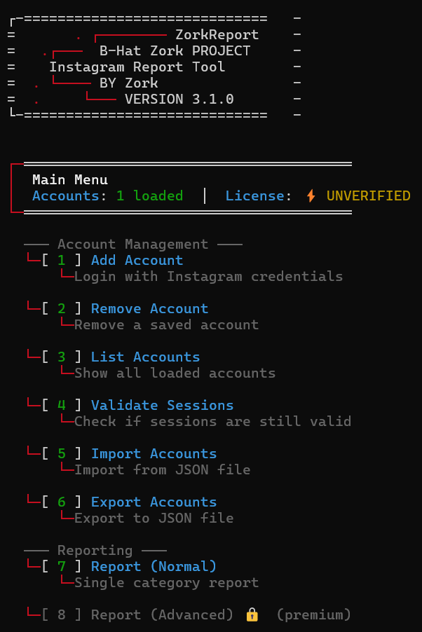

<h1 align="center">📊 Instagram Account Analysis Tool</h1>

<p align="center">
  
</p>

<p align="center">
  
  
  
  
</p>

<p align="center">
  <b>A comprehensive CLI tool for Instagram account security research and content moderation analysis</b>
</p>

<p align="center">
  <i>Built for security researchers, content moderators, and platform safety teams</i>
</p>

---

## 🎯 Purpose

This tool is designed for **authorized security researchers** and **content moderation teams** to:

- 🔬 Study Instagram's content moderation and reporting mechanisms
- 📈 Analyze account security patterns and vulnerabilities
- 🛡️ Test defensive measures against coordinated inauthentic behavior
- 📚 Educational research on social media platform safety

> ⚠️ **Disclaimer**: This tool is intended for **educational and authorized research purposes only**. Users must comply with Instagram's Terms of Service and applicable laws. Unauthorized use is strictly prohibited.

---

## ✨ Features

| Feature | Description | Access |
|---------|-------------|--------|
| 🔐 **Session Management** | Secure session handling with encrypted storage | Free |
| 📋 **Account Analysis** | Multi-account session validation | Free |
| 📊 **Content Reports** | Single-category content moderation testing | Free |
| ⚡ **Advanced Analysis** | Multi-category queue system | Premium |
| 🔍 **OSINT Tools** | Profile reconnaissance features | Premium |

---

## 🚀 Installation (Termux)

### Prerequisites

```bash
python --version
```

### Setup

```bash

git clone https://github.com/samay825/InstaX-Report
cd InstaX-Report

pkg install rust clang libffi openssl -y
pip install --upgrade pip setuptools wheel
pip install cryptography
pip install -r requirements.txt

chmod +x setup-termux.sh
bash setup-termux.sh

# After setup, run from anywhere:
report
```

### Quick Commands

| Command | Description |
|---------|-------------|
| `report` | Start the tool |
| `bash setup-termux.sh` | Re-run setup |

---

## 🪟 Windows / 🐧 Linux

<p align="center">
  <b>For Windows and Linux installation, contact on Telegram:</b>
</p>

<p align="center">
  <a href="https://t.me/sincryptzork">
    
  </a>
</p>

---

## 📦 Dependencies

```
requests>=2.28.0      # HTTP client
argon2-cffi>=21.3.0   # Secure hashing
```

---

## 🎨 Screenshots

```
┌─═══════════════════════════════════════
│  Main Menu
│  Accounts: 3 loaded  │  License: PREMIUM
└─═══════════════════════════════════════

  ─── Account Management ───
  └─[ 1 ] Add Account
  └─[ 2 ] Remove Account
  └─[ 3 ] List Accounts
  
  ─── Analysis Tools ───
  └─[ 7 ] Content Analysis (Basic)
  └─[ 8 ] Content Analysis (Advanced) ⚡

  ─── Research Tools ⚡ ───
  └─[ 9 ] Profile OSINT
  └─[ 10 ] Session Analysis
  ...
```

---

## 🔒 Security Features

- 🔐 **Argon2id** password hashing (memory-hard, GPU-resistant)
- 🌐 **Real-time license verification** via secure API
- 🔑 **Hardware fingerprint binding** for license security
- 📁 **Encrypted local storage** for sensitive data
- 🛡️ **Runtime integrity checks** against tampering

---

## ⚖️ Legal Notice

```
THIS SOFTWARE IS PROVIDED FOR EDUCATIONAL AND RESEARCH PURPOSES ONLY.

By using this software, you agree to:
1. Use it only for authorized security research
2. Comply with Instagram's Terms of Service
3. Follow all applicable local and international laws
4. Not use it for harassment, spam, or malicious purposes
5. Accept full responsibility for your actions

The developers are not responsible for any misuse of this tool.
```

---

## 📬 Contact

<p align="center">
  <a href="https://t.me/sincryptzork">
    
  </a>
</p>

---

<p align="center">
  <b>Built for Research • Used Responsibly • Stay Ethical</b>
</p>

<p align="center">
  
  
</p>
